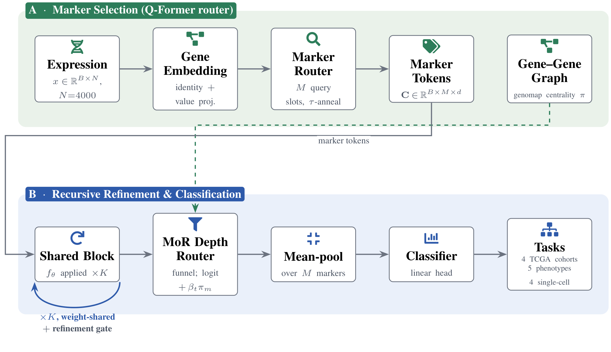
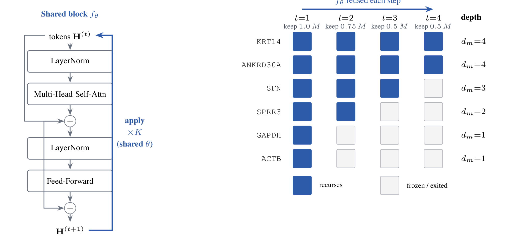

<div align="center">

# SMART: Selective Marker-guided Adaptive Recursive Transformer for Transcriptomic Classification

**Koushik Howlader¹ &nbsp;·&nbsp; Tirtho Roy¹ &nbsp;·&nbsp; Md Tauhidul Islam² &nbsp;·&nbsp; Wei Le¹**

¹ Iowa State University &nbsp;&nbsp; ² Stanford University

*Reference implementation and full reproduction harness. Manuscript currently under review (AAAI); not yet accepted.*

</div>

---

## Abstract

Transformer foundation models for transcriptomics treat every one of the ~20,000
measured genes as an equally important token and stack many *independent* layers,
which makes them parameter-heavy and computationally prohibitive. We argue that, for
gene expression, **parameter efficiency should be an architectural property rather
than something recovered by post-hoc pruning.** We introduce **SMART** (Selective
Marker-guided Adaptive Recursive Transformer), a transformer that **(i)** learns
end-to-end which genes are *marker* genes worthy of dedicated computation, using a
cross-attention **marker router** in which learnable marker queries attend over all
genes, so gradients reach every gene rather than a frozen pre-selected set;
**(ii)** represents each sample by only its `M ≪ N` selected markers, reducing
self-attention cost from `O(N²)` to `O(M²)`; and **(iii)** processes these marker
tokens with a *single* transformer block applied **recursively**, where a
**Mixture-of-Recursions (MoR)** router grants each gene its own *adaptive recursion
depth*. Most genes exit after one pass while a few disease drivers are iterated
deeper, so a gene's recursion depth becomes an intrinsic, compute-allocation-based
importance score instead of a post-hoc attention map.

On pan-cancer cohort classification SMART reaches **98.5% accuracy / 98.7% macro-F1**
while using **3.99× fewer** transformer-stack parameters than an equivalent stack of
independent layers and only **0.60×** of the fixed-depth recursion FLOPs. On five
harder clinical phenotype tasks defined on the same tumours (stage, T, N, overall
survival, tumour status), under an identical split and the full gene set, SMART
attains the best mean macro-F1 against ten strong nonlinear baselines (XGBoost,
LightGBM, CatBoost, HistGBM, MLPs, …), and it generalizes to four single-cell
datasets.

<div align="center">



**Figure 1. System overview.** *Panel A (marker selection):* the expression vector is
embedded (gene-identity + value), a cross-attention **marker router** with `M` learnable
query slots and a temperature anneal selects marker tokens, and a label-free **gene–gene
graph** supplies an optional genomap-centrality routing prior. *Panel B (recursive
refinement & classification):* a single weight-shared block `f_θ` is applied `×K` with a
refinement gate; a **MoR depth router** gives each marker its own recursion depth; mean-pooled
markers feed a linear classifier evaluated on 4 TCGA cohorts, 5 clinical phenotypes, and 4
single-cell datasets.

</div>

---

## Highlights / headline results

| Setting | Metric | SMART |
|---|---|---|
| Pan-cancer cohort (4-way, BRCA/HNSC/LUNG/THCA) | Accuracy / macro-F1 | **98.5% / 98.7%** |
| Parameter efficiency (shared vs. independent, K=4) | Transformer-stack param ratio | **3.99×** fewer |
| Compute (adaptive vs. fixed-depth recursion) | FLOPs ratio | **0.60×** |
| 5 clinical phenotypes (full 20,530 genes) | Mean macro-F1 vs. 10 baselines | **best mean** |
| Single-cell generalization | Datasets | 4 (Tabula Muris, common_class, prototype, pancreas) |

All numbers in the paper are **injected from the JSON result files** via `@@TOKEN@@`
placeholders — none are hand-typed (`make_paper` prints *"unresolved tokens: 0"*).

---

## Repository layout

```
recursive_marker_transformer/      # the model + training + all experiment runners + paper generator
  config.py              RMTConfig dataclass (every knob)
  data.py                genomic_dataloader wrapper (TCGA bulk); raw-variance HVG; safe label remap
  embedding.py           gene-identity + value embedding
  marker.py              SlotRouter (headline) + Concrete / variance / random selectors + refine gate
  recursion.py           SharedTransformerBlock + RecursiveStack (shared/independent, MoR routing, early-exit)
  router.py              expert-choice / token-choice Mixture-of-Recursions depth routers (+ bio prior)
  interaction.py         genomap gene–gene correlation graph -> eigenvector-centrality routing prior
  model.py               RecursiveMarkerTransformer (SMART) + exact param counters
  losses.py              task + marker + diversity + compression + router (z / balance) losses
  train.py               run(cfg) on TCGA cohorts; per-cohort report; persists class names
  experiments.py         ── EXP 1: TCGA ablation SUITE + exact param-efficiency table -> results/
  singlecell.py          ── EXP 2: SMART on the 4 single-cell CSV datasets        -> results_singlecell/
  genonet_tasks.py       ── EXP 3: SMART on 5 hard clinical phenotype tasks       -> results_genonet/
  baselines.py           ── EXP 4: 10 nonlinear baselines on the same tasks/split -> results_baselines/
  interaction_experiments.py  ── EXP 5: biology-informed-router ablation          -> results_interaction/
  earlystop_experiments.py    ── EXP 6: early-exit vs fixed-depth recursion       -> results_earlystop/
  extra_experiments.py        ── EXP 7: multi-seed + init/anneal 2x2x3            -> results_extra/
  sweeps.py                   ── EXP 8: multi-seed ablation + depth + marker-count -> results_sweeps/
  tune.py                     ── EXP 9: hyperparameter grid (width x M x K x lr)   -> results_tune/
  make_paper.py          reads results*/ -> paper/*.tex (+ TikZ figures); compiles to PDF
  bio_enrichment.py      Reactome enrichment of learned markers (supplementary)
genomic_dataloader/      # TCGA loader (downloads/caches UCSC Xena RNA-seq)
tools/convert_capsule_to_csv.py   # genomap capsule .mat/.csv -> readable CSVs (deterministic)
data/                    # SINGLE home for all data (tcga/ + singlecell/) — git-ignored, regenerable
results*/                # experiment JSONs that feed the paper (tracked)
paper/                   # generated .tex/.bib + compiled PDF + AAAI style files
assets/                  # rendered figures used by this README
run_all.sh               # local one-command: TCGA suite -> paper -> PDF
run_*.sbatch             # one Slurm job per experiment (GPU, scavenger partition)
PLAN.md, BIO_ROUTER_PLAN.md   # design notes & honest result logs
```

---

## Setup

```bash
# Python 3.11 venv (the repo was developed against torch 2.x + numpy<2)
python3.11 -m venv .venv && source .venv/bin/activate
pip install -r requirements.txt          # on a GPU box install the matching +cuXXX torch wheel
```

> **GPU note.** The model auto-selects `cuda > mps > cpu` (`resolve_device`). On CPU the
> TCGA runs are tractable but the single-cell / 20k-gene runs are slow (hours); on a single
> CUDA GPU each experiment below finishes in minutes to ~1 hour. Transfer the repo **without
> `.venv/`** and recreate it from `requirements.txt`.

---

## Data

| Source | Location | Description |
|---|---|---|
| **TCGA bulk RNA-seq** | `data/tcga/` | Illumina HiSeqV2 `log2(norm_count+1)` (~20.5k genes) for four cohorts — breast (BRCA), head-neck (HNSC), lung (LUNG), thyroid (THCA) — pulled from the UCSC Xena hub by `genomic_dataloader`. The 4-way `cancer_type` label is the primary task. |
| **BIO5 unified TCGA** | `data/tcga/unified_bio5.csv` | 2,738 tumours × 20,530 genes with five extra clinical phenotype labels: `pathologic_stage`, `pathologic_T`, `pathologic_N`, `os_binary`, `tumor_status`. Drives EXP 3/4/5/6/8/9. |
| **Single-cell** | `data/singlecell/<ds>/` | Four datasets from the genomap capsule (CodeOcean 6967747): **tabula_muris** (54,865 cells / 55 classes), **common_class** (27,499 / 19), **prototype** (90,579 / 10), **pancreas** (14,767 / 15). |

`data/` is git-ignored and fully regenerable. To rebuild the single-cell CSVs from the
original capsule zip:

```bash
python tools/convert_capsule_to_csv.py --zip capsule-6967747-data.zip --out data/singlecell
```

TCGA cohorts are fetched and cached automatically by `genomic_dataloader` on first run.

---

## Reproducing every experiment

Each experiment is a self-contained module under `recursive_marker_transformer/`. Below,
for every experiment, we give **what it tests**, the **local command** (`python -m …`), the
matching **Slurm job** (`sbatch run_*.sbatch`, scavenger partition, one GPU), the **output
directory**, and the **headline finding**. All runners are **resumable** — finished cells are
skipped on requeue — and **deterministic** (fixed seeds; per-dataset `split.csv` when present,
else a seeded stratified split).

### One-command local reproduction (TCGA + paper)

```bash
./run_all.sh                                  # EXP 1 -> results/ -> paper/ -> PDF
RMT_EPOCHS=25 RMT_NHVG=4000 ./run_all.sh      # scale up
RMT_ONLY=main,independent,depth1 ./run_all.sh # subset of the suite (comma-separated SUITE keys)
```

### One-command GPU reproduction (full sweep + paper)

```bash
sbatch run_sweep.sbatch     # EXP 1 (full) + EXP 2 + regenerate paper + compile PDF
```

---

### EXP 1 — TCGA ablation suite + exact parameter-efficiency table

*Headline model and all architectural ablations on the 4-way cohort task; plus the exact
shared-vs-independent parameter counts across recursion depth (no training).*

```bash
python -m recursive_marker_transformer.experiments \
    --epochs 25 --n_hvg 4000 --d_model 128 --n_markers 256 --depth 4 \
    --heads cancer_type --outdir results
# GPU: included in `sbatch run_sweep.sbatch`
```

**SUITE variants** (`--only <keys>`, comma-separated): `main` (cross-attention router +
shared recursion + expert-choice MoR, headline) · `mor_token` (token-choice MoR) ·
`fixed_depth` (no adaptive depth) · `sel_concrete` / `sel_variance` / `sel_random`
(marker-selection study at fixed depth) · `no_refine` (refinement gate off) · `depth1`
(K=1) · `independent` (no weight sharing). The exact shared-vs-independent parameter table
(`param_efficiency`) is computed analytically with no training. → `results/*.json`

**Result.** Cohort **98.5% acc / 98.7% macro-F1**; learned markers > variance > random; the
shared block uses **3.99× fewer** stack params than independent layers at K=4 (1.0/2.0/3.99/5.97/7.95×
at K=1/2/4/6/8) and adaptive depth costs only **0.60×** the fixed-depth FLOPs.

### EXP 2 — Single-cell generalization

*Run the headline SMART config (router selection + expert-choice MoR) on four single-cell
datasets to show the architecture is data-agnostic.*

```bash
python -m recursive_marker_transformer.singlecell \
    --epochs 25 --batch_size 256 --lr 1e-3 --patience 6 \
    --d_model 96 --n_markers 128 --device cuda --out results_singlecell
# GPU: step 2 of `sbatch run_sweep.sbatch`
```
→ `results_singlecell/<dataset>.json`

| Dataset | Cells | Genes | Classes | Acc | Macro-F1 |
|---|---|---|---|---|---|
| prototype | 90,579 | 752 | 10 | 0.930 | 0.927 |
| pancreas | 14,767 | 1,936 | 15 | 0.873 | 0.482 |
| common_class | 27,499 | 1,089 | 19 | 0.831 | 0.687 |
| tabula_muris | 54,865 | 1,089 | 55 | 0.632 | 0.560 |

> **Lesson logged in `PLAN.md`:** large batch + few epochs badly undertrains; use smaller
> batch + higher LR + more epochs/patience (the settings above).

### EXP 3 — Hard clinical phenotype tasks (full gene set)

*SMART on five low-signal clinical labels over all 20,530 genes (no HVG filtering).*

```bash
python -m recursive_marker_transformer.genonet_tasks \
    --csv data/tcga/unified_bio5.csv --out results_genonet \
    --epochs 40 --d_model 128 --n_markers 256 --batch_size 32 \
    --lr 3e-4 --patience 8 --device cuda
# GPU: sbatch run_genonet.sbatch
```
→ `results_genonet/{pathologic_stage,pathologic_T,pathologic_N,os_binary,tumor_status}.json`

**Result (SMART macro-F1):** stage 0.450 · T 0.415 · N 0.312 · OS 0.570 · tumour-status 0.583.

### EXP 4 — External baselines (10 nonlinear models, identical split)

*Apples-to-apples comparison on the same five tasks and identical train/test split.*

```bash
python -m recursive_marker_transformer.baselines \
    --csv data/tcga/unified_bio5.csv --out results_baselines
# GPU slot only for scheduling (sklearn/CPU): sbatch run_baselines.sbatch
```
→ `results_baselines/<task>.json` (XGBoost, LightGBM, CatBoost, HistGBM, RandomForest,
ExtraTrees, Logistic, SVM-RBF, MLPs, …)

**Result.** SMART attains the **best mean macro-F1** across the five tasks; per-task best
baselines: stage 0.507 (LightGBM), T 0.437 (HistGBM), N 0.369 (LightGBM), OS 0.498 (MLP),
tumour-status 0.530 (XGBoost).

### EXP 5 — Biology-informed router ablation (genomap interaction prior)

*Adds a label-free additive prior to the MoR depth-router logit: the eigenvector centrality
of each gene in genomap's gene–gene co-expression graph, annealed out over training. Tests
whether real co-expression structure helps routing. See `BIO_ROUTER_PLAN.md`.*

```bash
python -m recursive_marker_transformer.interaction_experiments \
    --tasks cohort pathologic_stage pathologic_T pathologic_N \
    --modes none coexpr random --seeds 0 1 2 \
    --beta 1.0 --knn 16 --anneal true --out results_interaction
# GPU: sbatch run_interaction.sbatch
```
→ `results_interaction/<task>__<mode>__seed<k>.json`

**Result (honest negative).** All three priors fall within one std on every task; `coexpr`
does **not** separate from the degree-matched `random`-graph control, so no accuracy gain is
attributable to biological co-expression structure on these labels (mild variance reduction
only). Reported transparently in the paper.

### EXP 6 — Early-exit vs. fixed-depth recursion

*Does per-token early exit recover the fixed-depth accuracy at lower realized depth?*

```bash
python -m recursive_marker_transformer.earlystop_experiments \
    --tasks cohort pathologic_stage pathologic_T pathologic_N \
    --modes fixed8 early8 --seeds 0 1 2 --out results_earlystop
# GPU: sbatch run_earlystop.sbatch
```
→ `results_earlystop/<task>__<mode>__seed<k>.json` (logs realized mean recursion depth).

### EXP 7 — Reviewer extras: multi-seed + init/anneal

*5-seed stability on the cohort task, plus a 2×2×3 grid over peaked-init × temperature-anneal ×
seed to isolate the two decisive marker-router ingredients.*

```bash
python -m recursive_marker_transformer.extra_experiments \
    --exp multiseed init_anneal --out results_extra
# GPU: sbatch run_extra.sbatch
```
→ `results_extra/{multiseed,init_anneal}/*.json`

### EXP 8 — Multi-seed ablation + depth sweep + marker-count sweep

*5-seed ablations and `K ∈ {1,2,4,6,8}` / marker-count `M` sweeps on the hard genoNet tasks.*

```bash
python -m recursive_marker_transformer.sweeps \
    --csv data/tcga/unified_bio5.csv --out results_sweeps \
    --exp ablate depth markers --device cuda
# GPU: sbatch run_sweeps.sbatch
```
→ `results_sweeps/{ablate,depth,markers}/<task>__<variant>__seed<k>.json`

### EXP 9 — Hyperparameter tuning grid

*16-point grid (`d_model × M × K × lr`) per hard task, model selection by validation macro-F1.*

```bash
python -m recursive_marker_transformer.tune \
    --csv data/tcga/unified_bio5.csv --out results_tune --device cuda
# GPU: sbatch run_tune.sbatch
```
→ `results_tune/<task>__d<..>_m<..>_k<..>_lr<..>.json`

---

## Building the paper

After any run, regenerate the AAAI `.tex` (every metric injected from `results*/`) and compile:

```bash
python -m recursive_marker_transformer.make_paper --results results --outdir paper
cd paper && pdflatex -interaction=nonstopmode genomicrecursiveformer.tex \
  && bibtex genomicrecursiveformer \
  && pdflatex -interaction=nonstopmode genomicrecursiveformer.tex \
  && pdflatex -interaction=nonstopmode genomicrecursiveformer.tex
```

The compiled PDF (`paper/genomicrecursiveformer.pdf`, 15 pp) contains the full main-results,
per-cohort, parameter-efficiency, ablation, single-cell, baseline, and routing-prior tables,
plus the two TikZ figures rendered above.

<div align="center">



**Figure 2. Adopting Mixture-of-Recursions.** A single weight-shared pre-norm block `f_θ` is
applied recursively; the expert-choice depth router keeps a shrinking fraction of marker tokens
each pass, so a gene's realized recursion depth is an adaptive, compute-allocation importance score.

</div>

---

## Reproducibility

- **Deterministic.** Fixed seeds throughout; single-cell splits use each dataset's own
  `split.csv` when present, else a seeded stratified split.
- **No hand-typed numbers.** Every value in the paper is injected from `results*/` via
  `@@TOKEN@@` placeholders; `make_paper` asserts *"unresolved tokens: 0"*.
- **Resumable jobs.** Each `(task, variant, seed)` cell is a separate JSON; requeued Slurm
  jobs skip finished cells.
- **Regenerable data.** `data/` is git-ignored; TCGA is fetched/cached by `genomic_dataloader`
  and the single-cell CSVs are byte-reproducible from the capsule via `convert_capsule_to_csv.py`.
- **Pinned deps.** `requirements.txt`.

---

## Citation

> **Status:** this manuscript is **under review** (submitted to AAAI); it has **not** been
> accepted or published yet. Please cite it as an unpublished manuscript until a venue is
> confirmed.

```bibtex
@unpublished{howlader2026smart,
  title  = {SMART: Selective Marker-guided Adaptive Recursive Transformer
            for Transcriptomic Classification},
  author = {Howlader, Koushik and Roy, Tirtho and Islam, Md Tauhidul and Le, Wei},
  note   = {Manuscript under review},
  year   = {2026}
}
```

## License

Proprietary and confidential. Copyright © 2026 The SMART Authors. All rights reserved.
See [`LICENSE`](LICENSE) for full terms.
